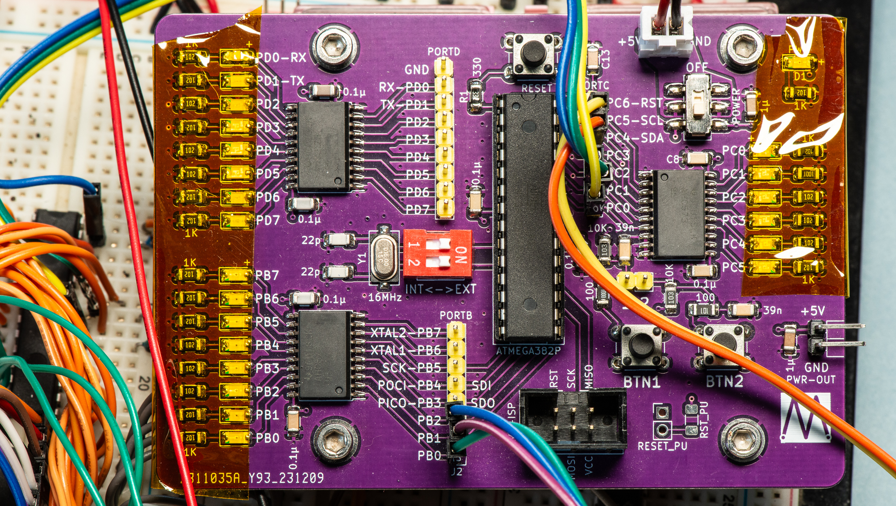

# Atmega328P Proto

A breakout/prototyping board for the DIP version of the ATMEGA328P microcontroller.

Every GPIO pin has a status LED, driven via a transparent latch, so as not to put a load on the pin.

The built-in 16MHz crystal can be isolated if you want to use the chip's internal clock.

