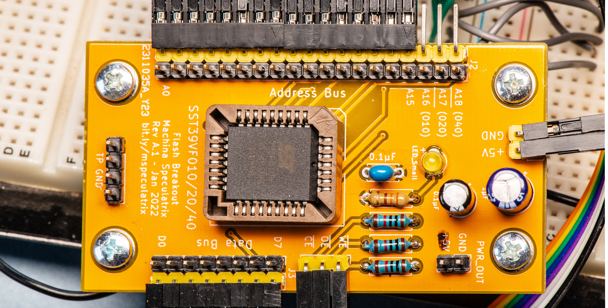

# SST39SF010-20-40 Flash Breakout Board

Nothing clever going on here. This just breaks out all the pins. It's designed to be used with the PLCC versions of the chips.

Although the silkscreen shows 5V power input, you could always supply 3.3V and use this board with the `VF` variants of the chips. Just make sure you match the right chip with the right voltage.

